# 📚 Project Context - Quiz Application

> **Last Updated**: September 7, 2025  
> **Version**: 1.0.0  
> **Framework**: Spring Boot 3.x + Java 17

---
### **Project Structure**
```
src/main/java/com/example/quiz/
├── 🎯 base/                     # Base classes cho CRUD modules
├── 🏛️ configuration/            # Security, cache, AOP configs
├── 🎮 controller/               # REST API endpoints
├── 📊 model/                    # Entities, DTOs, Views
├── 🗄️ repository/               # Data access layer
├── ⚙️ service/                  # Business logic
├── 🛠️ utils/                    # Utility classes
└── ✅ validators/               # Custom validation
```

---

## 🧩 **Base Architecture Pattern**

### **📋 Quy tắc thiết kế modules**

> **Rule #1**: Modules có CRUD operations **BẮT BUỘC** extends từ Base classes  
> **Rule #2**: Services đặc thù (không CRUD) tạo Interface + Implementation độc lập

### **🎯 Base Classes Hierarchy**

```mermaid
graph TD
    A[BaseEntity] --> B[User Entity]
    A --> C[Quiz Entity]
    A --> D[QuizCategory Entity]
    
    E[BaseController] --> F[UserController]
    E --> G[QuizController]
    E --> H[QuizCategoryController]
    
    I[BaseService] --> J[UserService]
    I --> K[QuizService]
    I --> L[QuizCategoryService]
    
    M[BaseServiceImpl] --> N[UserServiceImpl]
    M --> O[QuizServiceImpl]
    M --> P[QuizCategoryServiceImpl]
    
    Q[BaseRepository] --> R[UserRepository]
    Q --> S[QuizRepository]
    Q --> T[QuizCategoryRepository]
```



---

## 🏛️ **Base Classes Chi Tiết**

### **1. 📊 BaseEntity**
```java
@MappedSuperclass
public abstract class BaseEntity {
    private Long id;
    private Instant createdAt;
    private String createdBy;
    private Instant updatedAt;
    private String updatedBy;
    // Auto auditing fields
}
```

### **2. 🎮 BaseController<E, ID, R, P, V>**
```java
// Provides: GET /all, GET /{id}, POST /create, PUT /edit/{id}, DELETE /{id}
// Security: @PreAuthorize annotations for permission checking
// Generics: E=Entity, ID=Primary Key, R=Request DTO, P=Response DTO, V=View
```

### **3. ⚙️ BaseService<E, ID, R, P, V>**
```java
// Interface defining: findAll(), getById(), create(), update(), delete()
// Pagination: getAll(Pageable), getAllWithPaging(RequestPagingDto)
```

### **4. 🔧 BaseServiceImpl<E, ID, R, P, V>**
```java
// Implementation with: CRUD operations, pagination, mapping (MapStruct)
// Override methods để custom business logic
```

### **5. 🗄️ BaseRepository<E, ID>**
```java
// Extends JpaRepository với custom query methods
// Soft delete support, audit fields
```

---

## 📝 **Module Creation Guide**

### **🎯 Scenario 1: CRUD Module (VD: Quiz Management)**

#### **Step 1: Tạo Entity**
```java
@Entity
@Table(name = "quizzes")
public class Quiz extends BaseEntity {
    private String title;
    private String description;
    private QuizCategory category;
    // Business fields
}
```

#### **Step 2: Tạo DTOs**
```java
// Request DTO
public class QuizRequest {
    @NotBlank private String title;
    @NotBlank private String description;
    private Long categoryId;
}

// Response DTO  
public class QuizResponse {
    private Long id;
    private String title;
    private String description;
    private QuizCategoryResponse category;
}
```

#### **Step 3: Tạo View & ViewRepository**
```java
// Database View for optimized queries
@Entity
@Table(name = "quiz_view")
public class QuizView {
    private Long id;
    private String title;
    private String categoryName;
    private Integer questionCount;
    // Calculated/joined fields
}

// View Repository
public interface QuizViewRepository extends JpaRepository<QuizView, Long> {
    // Custom view queries
}
```

#### **Step 4: Tạo Repository**
```java
@Repository
public interface QuizRepository extends BaseRepository<Quiz, Long> {
    List<Quiz> findByCategoryId(Long categoryId);
    @Query("SELECT q FROM Quiz q WHERE q.isActive = true")
    List<Quiz> findActiveQuizzes();
}
```

#### **Step 5: Tạo Service Interface**
```java
public interface QuizService extends BaseService<Quiz, Long, QuizRequest, QuizResponse, QuizView> {
    // Custom business methods
    List<QuizResponse> getQuizzesByCategory(Long categoryId);
    QuizResponse publishQuiz(Long quizId);
}
```

#### **Step 6: Implement Service**
```java
@Service
@Transactional
public class QuizServiceImpl 
    extends BaseServiceImpl<Quiz, Long, QuizRequest, QuizResponse, QuizView> 
    implements QuizService {
    
    public QuizServiceImpl(
        BaseRepository<Quiz, Long> repository,
        QuizMapper mapper,
        QuizViewRepository viewRepository) {
        super(repository, mapper, viewRepository);
    }
    
    // Override base methods nếu cần custom logic
    @Override
    public QuizResponse create(QuizRequest request) {
        // Custom validation
        if (isDuplicateTitle(request.getTitle())) {
            throw new AppException(ErrorCode.ENTITY_EXISTED);
        }
        // Call parent implementation
        return super.create(request);
    }
    
    // Implement custom business methods
    @Override
    public List<QuizResponse> getQuizzesByCategory(Long categoryId) {
        return repository.findByCategoryId(categoryId)
            .stream()
            .map(mapper::entityToResponse)
            .collect(Collectors.toList());
    }
}
```

#### **Step 7: Tạo Controller**
```java
@RestController
@RequestMapping("/api/quizzes")
@RequirePermission(resource = "QUIZ", action = "READ") // Class-level permission
public class QuizController 
    extends BaseController<Quiz, Long, QuizRequest, QuizResponse, QuizView> {
    
    private final QuizService quizService;
    
    public QuizController(
        BaseService<Quiz, Long, QuizRequest, QuizResponse, QuizView> service,
        QuizService quizService) {
        super(service);
        this.quizService = quizService;
    }
    
    // Custom endpoints beyond CRUD
    @GetMapping("/category/{categoryId}")
    @RequirePermission(resource = "QUIZ", action = "READ")
    public ApiResponse<List<QuizResponse>> getQuizzesByCategory(@PathVariable Long categoryId) {
        return ApiResponse.successOf(quizService.getQuizzesByCategory(categoryId));
    }
    
    @PostMapping("/{id}/publish")
    @RequirePermission(resource = "QUIZ", action = "UPDATE")
    public ApiResponse<QuizResponse> publishQuiz(@PathVariable Long id) {
        return ApiResponse.successOf(quizService.publishQuiz(id));
    }
}
```

#### **Step 8: Tạo Mapper (MapStruct)**
```java
@Mapper(componentModel = "spring")
public interface QuizMapper extends BaseMapstruct<Quiz, QuizRequest, QuizResponse, QuizView> {
    
    @Mapping(target = "category", source = "categoryId", qualifiedByName = "categoryIdToEntity")
    Quiz requestToEntity(QuizRequest request);
    
    @Mapping(target = "category", source = "category")
    QuizResponse entityToResponse(Quiz entity);
    
    // Custom mapping methods
    @Named("categoryIdToEntity")
    default QuizCategory categoryIdToEntity(Long categoryId) {
        // Implementation
    }
}
```

---

### **🔧 Scenario 2: Specialized Service (VD: AuthorizationService)**

#### **📋 Quy tắc cho Non-CRUD Services**
- **KHÔNG extends** từ Base classes
- Tạo **Interface + Implementation** độc lập
- Focus vào **business logic** cụ thể

#### **Ví dụ: AuthorizationService**
```java
// Interface
public interface AuthorizationService {
    boolean hasPermission(String resource, String action);
    boolean hasAnyRole(String[] roles);
    boolean isAdmin();
    List<Permission> getCurrentUserPermissions();
}

// Implementation
@Service
@RequiredArgsConstructor
public class AuthorizationServiceImpl implements AuthorizationService {
    
    private final SecurityContextManager contextManager;
    private final PermissionRepository permissionRepository;
    
    @Override
    public boolean hasPermission(String resource, String action) {
        // Business logic implementation
    }
    
    // Other methods...
}
```


---

## 🎯 **Quick Reference**

### **Creating New CRUD Module Checklist**
- [ ] 1. Create Entity (extends BaseEntity)
- [ ] 2. Create Request/Response DTOs
- [ ] 3. Create View + ViewRepository
- [ ] 4. Create Repository (extends BaseRepository)
- [ ] 5. Create Service Interface (extends BaseService)
- [ ] 6. Create ServiceImpl (extends BaseServiceImpl)
- [ ] 7. Create Controller (extends BaseController)
- [ ] 8. Create Mapper (extends BaseMapstruct)
- [ ] 9. Add permission annotations
- [ ] 10. Write unit tests

### **Creating Specialized Service Checklist**
- [ ] 1. Create Service Interface
- [ ] 2. Create ServiceImpl
- [ ] 3. Inject required dependencies
- [ ] 4. Add @Service annotation
- [ ] 5. Write unit tests

---

*📝 **Note**: This document should be updated whenever significant architectural changes are made to maintain context accuracy.*
